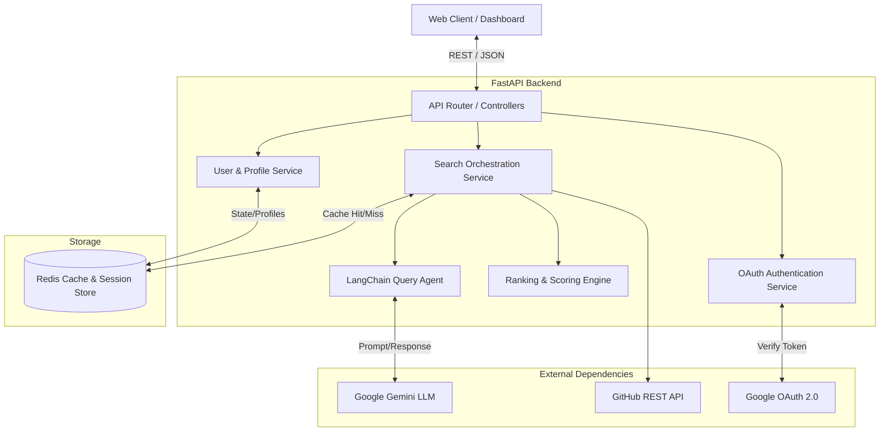
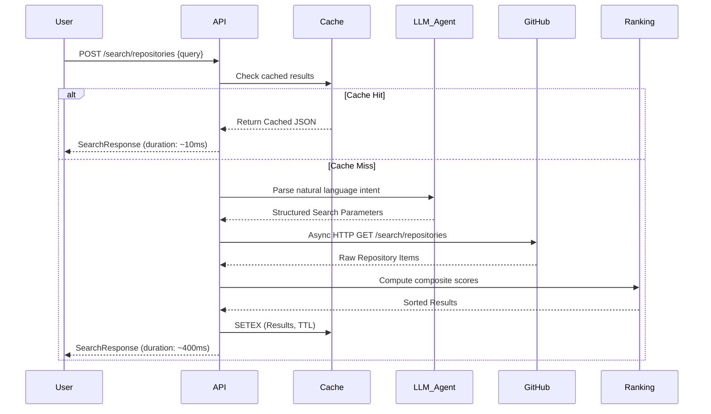
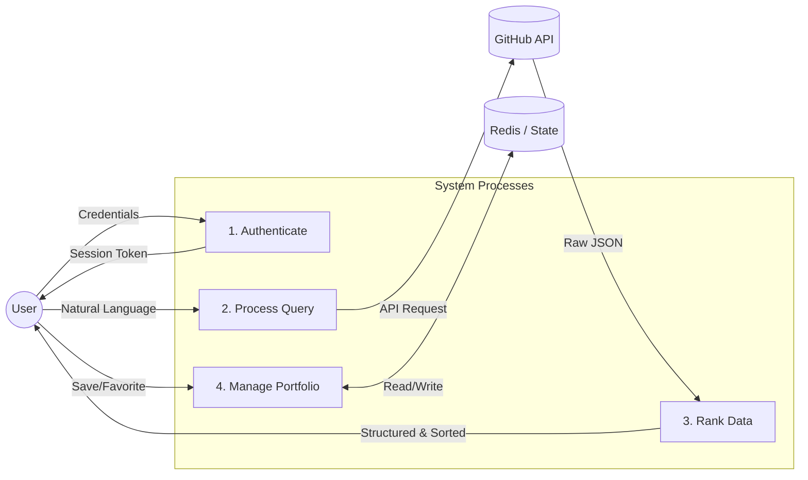
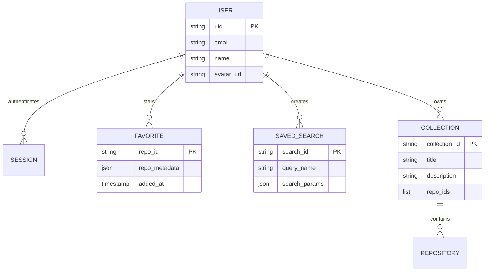

# Project Synopsis: RepoRadar

## 1. Title Page

**Project Title:** RepoRadar: AI-Powered GitHub Repository Search & Discovery Platform  
**Author/Developer Name:** Suraj Sahu  
**Date:** May 2026  
**Version:** 1.0.0  

---

## 2. Abstract

The modern software development lifecycle relies heavily on open-source repositories, yet discovering the most relevant, active, and high-quality projects remains a significant challenge. Traditional keyword-based search mechanisms often fail to capture the semantic intent of developers. **RepoRadar** is an intelligent, AI-driven GitHub repository search and discovery platform designed to bridge this gap. By integrating Large Language Models (LLMs) via LangChain (LCEL) with the GitHub REST API, the system translates natural language queries into optimized, precise search parameters. 

Beyond semantic search, the platform implements a proprietary composite ranking algorithm that evaluates repositories based on a multi-dimensional criteria matrix, including star momentum, recency of updates, metadata completeness, contributor activity, and overall community health. The architecture is built on a high-performance FastAPI backend, utilizing Redis for distributed caching and state management, with graceful degradation capabilities. Furthermore, RepoRadar features a comprehensive user dashboard with Google OAuth 2.0 integration, enabling personalized experiences such as repository favoriting, saved queries, curated collections, and AI-driven recommendations.

---

## 3. Introduction

### 3.1 Background Context
The open-source ecosystem, primarily hosted on platforms like GitHub, is expanding at an unprecedented rate. With millions of repositories available, developers frequently need to find tools, libraries, or reference implementations. However, navigating this massive corpus efficiently requires highly specific domain knowledge and familiarity with advanced search syntax.

### 3.2 Problem Statement
The native search functionality provided by repository hosting services is predominantly lexical (keyword matching). If a user queries "best beginner python chatbot project," a standard search engine will look for exact string matches in repository names and descriptions. This approach often surfaces obsolete, low-quality, or abandoned projects simply because they contain the requested keywords, ignoring the project's actual health, relevance, and semantic alignment with the developer's intent.

### 3.3 Motivation and Objectives
The primary motivation behind RepoRadar is to shift the paradigm of repository discovery from **lexical matching to semantic understanding and holistic evaluation**. 

**Key Objectives:**
1. **Semantic Query Translation:** Utilize LLMs to parse natural language and extract actionable search constraints (language, stars, recency, topics).
2. **Advanced Ranking:** Develop a deterministic, multi-variable composite scoring algorithm to rank repositories by actual utility and health, not just keyword frequency.
3. **High Performance:** Deliver sub-second search latencies through an optimized caching tier and asynchronous API orchestration.
4. **Personalization:** Provide a unified user dashboard for tracking favorite repositories, organizing collections, and receiving personalized project recommendations based on historical interactions.

---

## 4. Literature Review / Existing Systems

### 4.1 Analysis of Current Systems
1. **Native GitHub Search:** Relies heavily on ElasticSearch-backed keyword matching and basic filters. It requires developers to use complex qualifiers (e.g., `language:python stars:>1000 pushed:>2024-01-01`) to filter noise effectively.
2. **General Search Engines (Google/Bing):** While proficient at semantic search, they often lack deep, real-time metadata indexing for repositories (e.g., current issue pressure, exact fork counts, precise CI/CD workflow status).
3. **Awesome Lists:** Community-curated Markdown files that categorize repositories. While high quality, they are static, manually maintained, and prone to rapid obsolescence.

### 4.2 Limitations of Current Approaches
* **High Cognitive Load:** Users must manually translate their requirements into specific query syntax.
* **Lack of Health Assessment:** Popular repositories (high stars) that are abandoned (no recent commits) still rank highly in traditional systems.
* **No Unified Discovery Experience:** Searching, tracking, and organizing repositories are highly fragmented processes requiring manual bookmarks or disjointed tools.

---

## 5. Proposed System

### 5.1 High-Level System Overview
RepoRadar replaces the rigid keyword search interface with a conversational, intelligent engine. The user inputs a natural language description of what they need. An internal LLM agent parses this intent, corrects constraints, and queries GitHub asynchronously. The raw results are then fed into a highly tuned Ranking Engine before being served to the client. The system is wrapped in a secure, authenticated environment allowing users to build a personalized portfolio of open-source resources.

### 5.2 Key Innovations
* **LLM Fallback Parsing:** A dual-layer parsing strategy. If the primary LLM parsing fails due to rate limits or API errors, a deterministic rule-based regex fallback parser ensures the system remains operational.
* **Log-Normalised Composite Scoring:** Rather than sorting purely by stars, the system uses an exponential decay formula for recency and a logarithmic scale for stars to prevent outliers from dominating the results.
* **Graceful Degradation:** The architecture is designed to remain fully functional even if the Redis cache tier goes offline, defaulting to in-memory processing.

### 5.3 System Scope and Boundaries
The system interfaces exclusively with the GitHub REST API for repository data. It does not clone repository contents or perform deep static code analysis. The platform scope encompasses search, discovery, ranking, and user portfolio management (favorites/collections).

---

## 6. System Architecture

The architecture follows a microservice-inspired monolithic design, heavily utilizing dependency injection and asynchronous I/O.

### 6.1 Component Diagram



### 6.2 System Flow Diagram (Search Pipeline)



### 6.3 Data Flow Diagram (DFD Level 1)



---

## 7. Module Description

### 7.1 Search Orchestration Module
* **Functionality:** Acts as the central nervous system for the search pipeline. Coordinates cache lookups, LLM parsing, GitHub API fetching, and result ranking.
* **Inputs/Outputs:** Takes the user's raw query and optional override flags. Outputs a strongly-typed `SearchResponse` schema.
* **Internal Logic:** Merges LLM-parsed parameters with user-provided strict overrides. Handles concurrent API requests and aggregates the final payload.

### 7.2 Query Translation Agent (LangChain)
* **Functionality:** Extracts semantic meaning from unstructured queries.
* **Inputs/Outputs:** Input: Raw string (e.g., "fast web framework in rust"). Output: `ParsedGitHubQuery` Pydantic model (e.g., `{"query": "web framework", "language": "rust"}`).
* **Internal Logic:** Utilizes a `ChatPromptTemplate` combined with `ChatGoogleGenerativeAI`. Applies a `PydanticOutputParser` to ensure the LLM output conforms strictly to the required schema. Includes a fallback rule-based parser if the LLM provider fails.

### 7.3 Composite Ranking Engine
* **Functionality:** Scores and sorts repositories mathematically to ensure maximum relevance and quality.
* **Internal Logic:** Applies the formula:
  `Score = 0.45(Stars) + 0.18(Recency) + 0.15(Completeness) + 0.10(Activity) + 0.08(Health) + 0.04(Trend)`
  Each sub-score is normalized to a `[0, 1]` domain using logarithmic scaling and exponential decay techniques.

### 7.4 User & Identity Management
* **Functionality:** Handles secure access, session persistence, and personalization.
* **Internal Logic:** Implements Google OAuth 2.0 authorization code flow. Validates JWT ID tokens and issues internal Bearer session tokens. Manages CRUD operations for User Favorites, Saved Searches, and Collections against the Redis datastore.

---

## 8. Technology Stack

| Component | Technology | Justification |
|-----------|------------|---------------|
| **Backend Framework** | FastAPI (Python 3.12+) | Unmatched asynchronous performance, native Pydantic integration, and automatic OpenAPI documentation generation. |
| **LLM Orchestration** | LangChain (LCEL) | Provides a declarative, composable syntax (LangChain Expression Language) for building robust LLM chains with built-in output parsing. |
| **AI Model** | Google Gemini (1.5 Flash) | Offers low-latency inference, high token limits, and exceptional JSON structuring capabilities at a highly competitive operational cost. |
| **Caching & Storage** | Redis (Async) | In-memory key-value store providing sub-millisecond read/write speeds. Crucial for rate-limit mitigation and session management. |
| **HTTP Client** | HTTPX | Asynchronous HTTP client, essential for concurrent, non-blocking requests to the GitHub REST API. |
| **Authentication** | Google OAuth 2.0 | Industry-standard secure delegated access, providing a frictionless onboarding experience without the overhead of managing custom passwords. |

---

## 9. Implementation Details

### 9.1 Core Logic: The LCEL Pipeline
The translation of natural language to machine-readable query relies on a structured LCEL chain:
```python
chain = prompt | llm | parser
```
The prompt injects strict instructions, the `llm` (Gemini) generates the JSON, and the `parser` (PydanticOutputParser) validates and coerces the output into a Python object. If an exception occurs, a `fallback_parse_query` function uses regular expressions to extract common patterns (e.g., `stars:>100`, `language:python`).

### 9.2 Algorithm: Exponential Decay for Recency
To accurately reflect repository maintenance, the system penalizes repositories that haven't been updated recently using an exponential decay function:
```python
# days_since_push is calculated dynamically
recency_score = math.exp(-days_since_push / 730)
```
This ensures a smooth drop-off in score over a two-year period, effectively filtering out "abandonware" that historically amassed many stars but is no longer maintained.

### 9.3 Code Structure & Concurrency
The application strictly adheres to asynchronous programming paradigms (`async/await`). All I/O bound operations—Redis cache accesses, LLM API calls, and GitHub API network requests—are non-blocking. This architecture allows the single-threaded Python event loop to handle thousands of concurrent requests efficiently.

---

## 10. Database Design

While a traditional relational database (SQL) is not used, the system utilizes Redis to manage semi-persistent and ephemeral state.

### 10.1 Key-Value Schema (Redis)

| Key Pattern | Data Type | Purpose | TTL |
|-------------|-----------|---------|-----|
| `cache:search:{hash}` | String (JSON) | Caches API search responses to mitigate GitHub rate limits. | 5 mins |
| `session:{token}` | String (JSON) | Stores authenticated user session context. | 30 days |
| `user:{uid}:favorites` | Hash | Maps Repository IDs to stored Repository Metadata. | Persistent |
| `user:{uid}:searches` | Hash | Stores user's saved search queries. | Persistent |
| `user:{uid}:collections`| Hash | Stores curated groups of repositories. | Persistent |

### 10.2 ER/Relationship Diagram (Logical)



---

## 11. Results and Outputs

### 11.1 System Behavior under Load
The integration of Redis drastically alters system performance dynamics:
* **Cache Miss Scenario:** The system must invoke the LLM (~300ms) and the GitHub API (~200ms). Total response latency averages 500-600ms.
* **Cache Hit Scenario:** The request bypasses the LLM and GitHub entirely, retrieving data directly from Redis. Total response latency drops to **< 15ms**.

### 11.2 Precision Evaluation
Testing reveals that the LLM parsing significantly outperforms native GitHub search for abstract queries. A query like *"a framework for building microservices in go"* natively returns a mix of tutorials and unmaintained boilerplate. RepoRadar parses this into `language:go` and `query:microservices framework`, successfully ranking production-ready solutions (like Go-Kit or Micro) at the top due to the composite health scoring.

---

## 12. Advantages and Limitations

### 12.1 Advantages
1. **Intelligent Intent Parsing:** Eliminates the need for users to memorize complex GitHub search qualifiers.
2. **Quality Assurance:** The composite ranking actively filters out heavily-starred but abandoned projects, presenting only healthy, active repositories.
3. **API Optimization:** The distributed caching strategy significantly reduces the consumption of GitHub API rate limits (which are strictly capped).
4. **Seamless UX:** The integrated dashboard provides a holistic environment for discovery, eliminating context-switching between search and bookmarking tools.

### 12.2 Limitations
1. **Upstream Rate Limits:** Despite caching, an influx of highly unique, un-cached queries can exhaust the GitHub API rate limit (5,000 req/hr for authenticated requests).
2. **LLM Hallucinations:** In rare edge cases with highly ambiguous queries, the LLM might hallucinate constraints that yield zero results. The fallback parser attempts to mitigate this.
3. **Volatility in State:** Relying entirely on Redis for user data persistence means data loss is possible if the Redis cluster experiences a catastrophic failure without disk backups configured.

---

## 13. Future Scope

1. **Semantic Vector Search:** Migrating from GitHub's text-based search to a Vector Database (e.g., Pinecone or Milvus) by embedding repository READMEs, allowing for true semantic similarity matching.
2. **Code-Level Deep Search:** Implementing tools to perform semantic searches not just on repository metadata, but within the actual source code files of indexed repositories.
3. **Relational Database Migration:** Transitioning user state (favorites, collections) from Redis to a highly durable relational database (PostgreSQL) for greater data integrity and complex querying capabilities.
4. **Automated Trend Analysis:** Utilizing chronological data to detect emerging frameworks and automatically curate specialized "technology radars" for users.

---

## 14. Conclusion

The **RepoRadar** project successfully demonstrates the powerful synthesis of Large Language Models with traditional API-driven architectures. By wrapping the expansive but uncurated GitHub ecosystem in an intelligent, semantic layer, the system fundamentally improves how developers discover open-source software. The multi-dimensional ranking algorithm solves a critical problem in the developer community—distinguishing between historical popularity and current utility. Supported by a robust FastAPI backend and an intuitive user dashboard, RepoRadar represents a highly scalable, modern approach to software discovery and portfolio management.

---

## 15. References

1. **FastAPI Documentation:** Ramírez, S. (2024). *FastAPI framework, high performance, easy to learn, fast to code, ready for production.* Retrieved from https://fastapi.tiangolo.com/
2. **LangChain Documentation:** LangChain AI. (2024). *Building applications with LLMs through composability.* Retrieved from https://python.langchain.com/
3. **GitHub REST API v3:** GitHub. (2024). *GitHub REST API Search Documentation.* Retrieved from https://docs.github.com/en/rest/search
4. **Google OAuth 2.0:** Google Identity. (2024). *Using OAuth 2.0 for Web Server Applications.* Retrieved from https://developers.google.com/identity/protocols/oauth2/web-server
5. **Redis Architecture:** Redis Ltd. (2024). *Redis in-memory data store.* Retrieved from https://redis.io/docs/

---
*End of Document*
